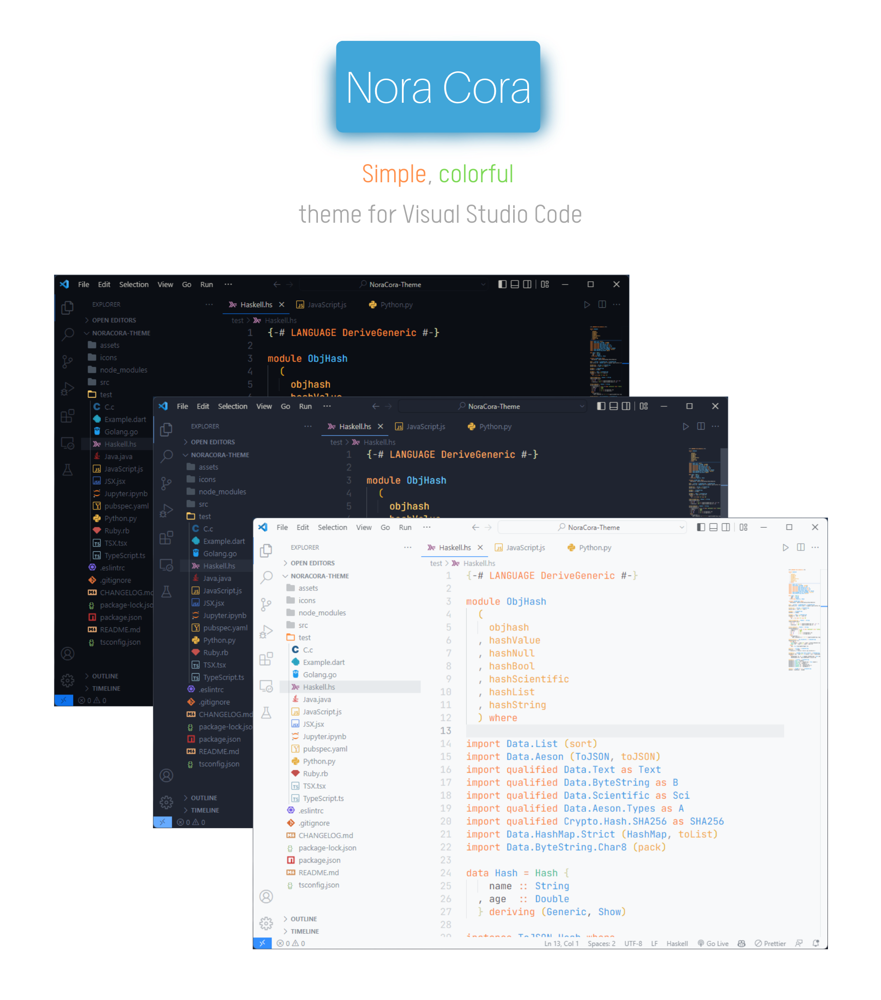
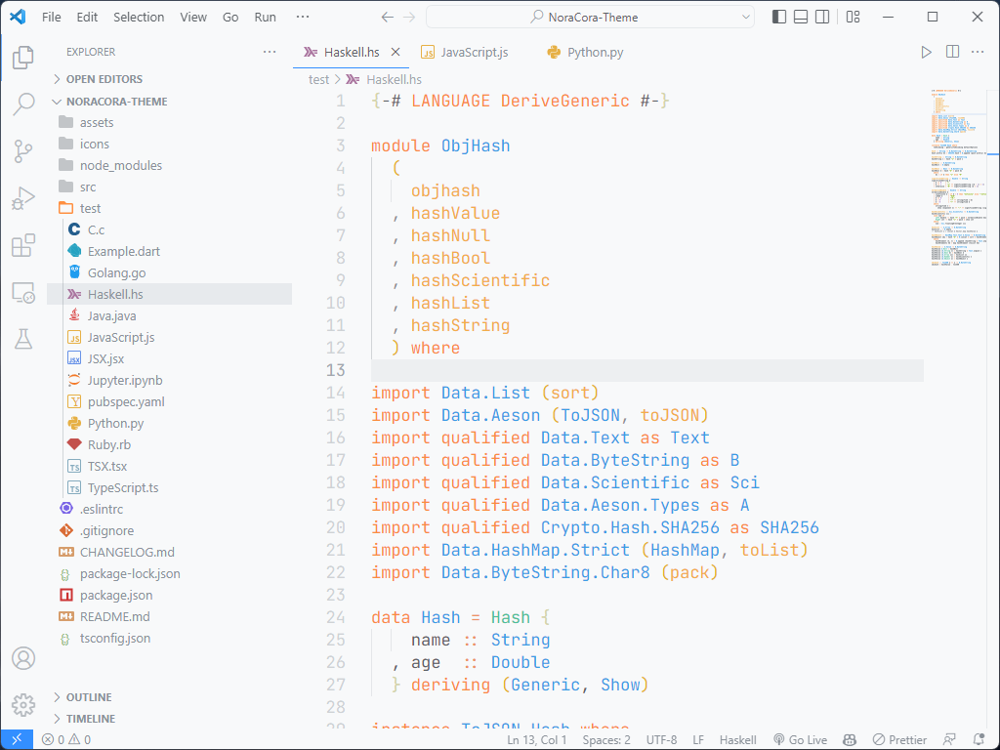
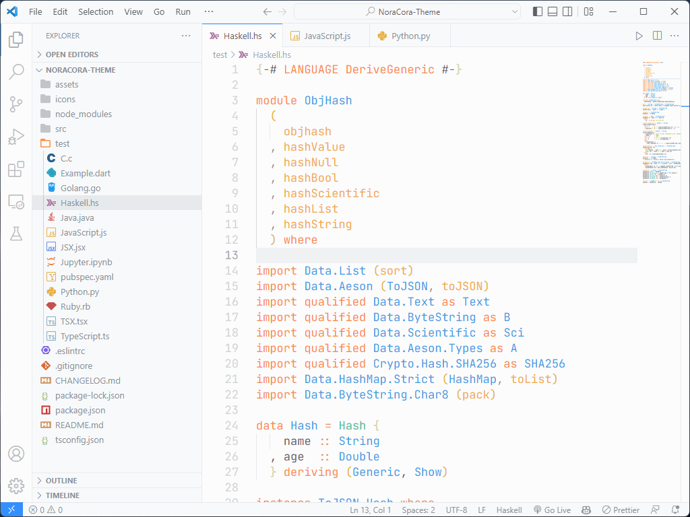
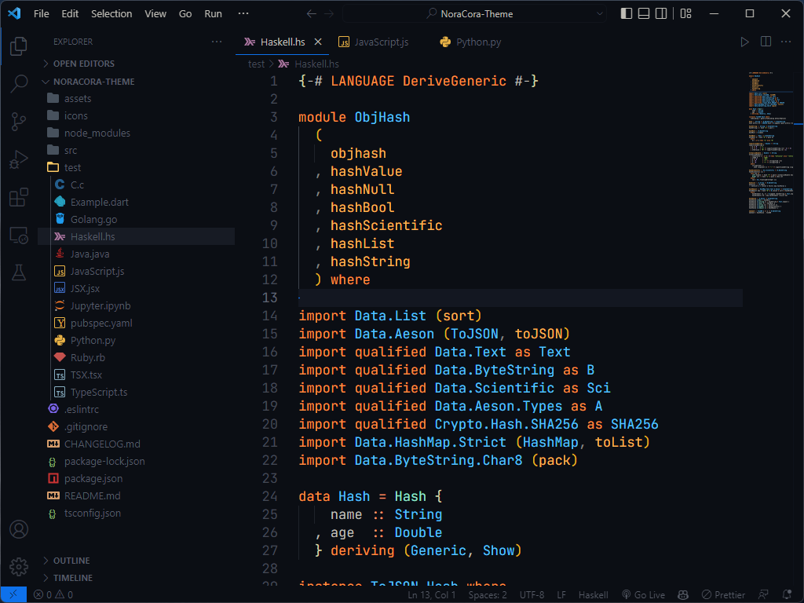

> Source from: https://github.com/Sathmin-Januth/NoraCora-Theme

A simple theme with bright colors and comes in three versions — *dark*, *light* and *mirage* for all day long comfortable work.

> Note that this isn't a theme maintained by the original [Nora Cora theme](https://github.com/Sathmin-Januth/NoraCora-Theme) author so please report issues related to this theme here.

## Install

```shell
ext install NoraCora-Theme
```

Then go to `Preferences > Color Theme > Nora Light(or Nora Dark, or Nora Mirage)`.
If you want to setup File Icon, then go to `Preferences > File Icon Theme > Nora`.

## Screenshots

#### Light



#### Mirage


#### Dark



## Development

Install dependencies
```shell
npm install
```

Update themes and build VSIX package
```shell
npm run build && npm run package
```
